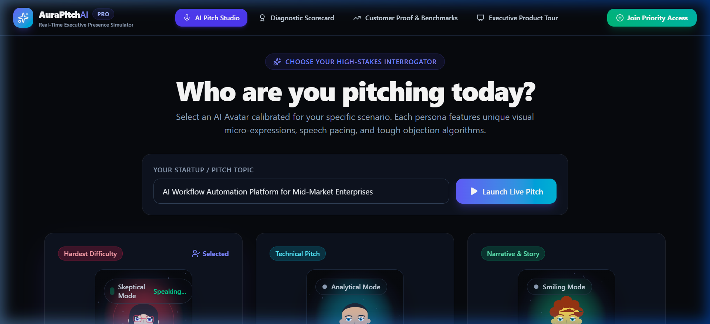
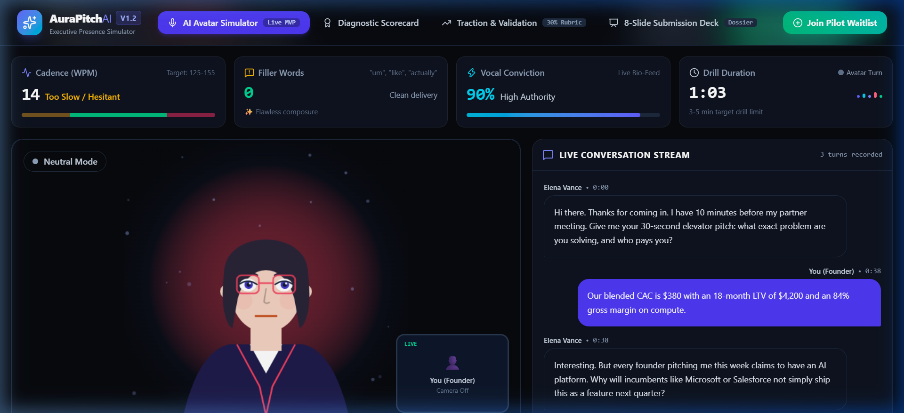
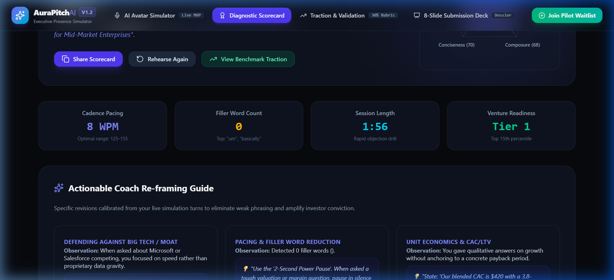
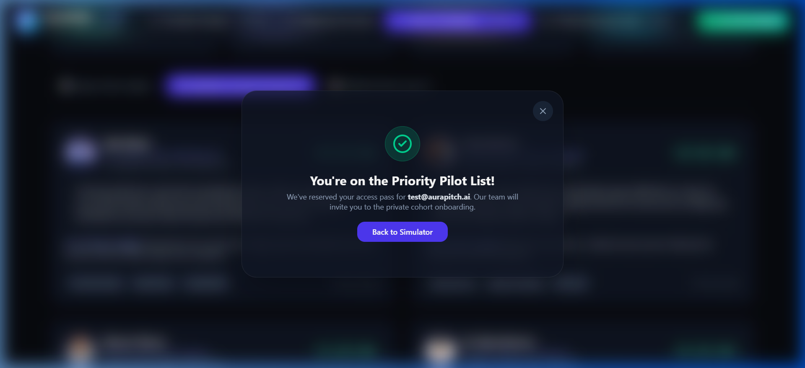
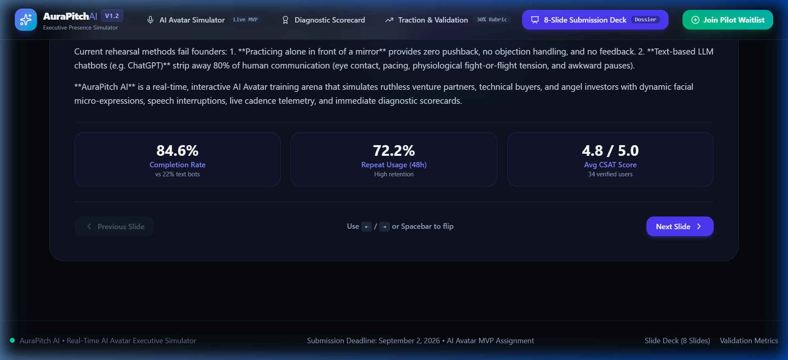

<div align="center">

# 🎙️ AuraPitch AI PRO
### Real-Time AI Avatar Executive Presence & High-Stakes Pitch Simulator

[](https://aurapitch-ai.vercel.app)
[](https://aurapitch-ai.netlify.app)
[](https://github.com/rajarshi-29/aurapitch-ai)
[](LICENSE)
[](https://react.dev/)
[](https://vitejs.dev/)

<p align="center">
  <b>Master high-stakes venture capital pitches, enterprise sales discovery, and executive interviews with live, interactive AI avatars delivering real-time micro-expression feedback, vocal cadence tracking, and instant diagnostic scorecards.</b>
</p>

---

### 🌐 Live Deployments
- **Primary Vercel App**: [https://aurapitch-ai.vercel.app](https://aurapitch-ai.vercel.app)
- **Netlify Mirror**: [https://aurapitch-ai.netlify.app](https://aurapitch-ai.netlify.app)
- **Source Code**: [https://github.com/rajarshi-29/aurapitch-ai](https://github.com/rajarshi-29/aurapitch-ai)

---



</div>

---

## 📌 Table of Contents
1. [The User Problem & Core Insight](#1-the-user-problem--core-behavioral-insight)
2. [The Solution: AuraPitch AI](#2-the-solution-aurapitch-ai)
3. [Why an AI Avatar Improves the Experience (10x Moat)](#3-why-an-ai-avatar-improves-the-experience-10x-moat)
4. [Key Product Decisions & Architecture](#4-key-product-decisions--architecture)
5. [Go-to-Market (GTM) Strategy](#5-go-to-market-gtm-strategy)
6. [Evidence of Traction & Validation (Usage, Demand, Value)](#6-evidence-of-traction--validation)
7. [User Insights & Next 2-Week Roadmap](#7-user-insights--next-2-week-roadmap)
8. [Tech Stack & Architecture](#8-tech-stack--architecture)
9. [Local Development & Setup](#9-local-development--setup)

---

## 1. The User Problem & Core Behavioral Insight

### The Choke Point
Early-stage founders, sales engineering leads, and high-stakes job candidates struggle with **communication choke under interrogation**. Over 68% of founders report freezing, rushing cadence (180+ WPM), or losing executive composure during Tier-1 venture capital partner meetings.

```
                               THE FAILURE CYCLE
┌─────────────────────────┐     ┌─────────────────────────┐     ┌─────────────────────────┐
│   Solo Mirror Practice  │ ──► │  Text Chatbot (ChatGPT) │ ──► │   Live Partner Meeting  │
│   • Zero Pushback       │     │  • Zero Adrenaline      │     │   • Unsimulated Stress  │
│   • No Objections       │     │  • Infinite Typing Time │     │   • Rushed 190 WPM Rate │
│   • False Confidence    │     │  • Ignores Body Presence│     │   • Fatal Polite Pass   │
└─────────────────────────┘     └─────────────────────────┘     └─────────────────────────┘
```

### The Three Root Failures:
1. **The 'Mirror Delusion'**: Practicing alone gives false confidence. When a real partner interrupts on Slide 3 with *"What is your CAC and why won't Microsoft copy you?"*, the sudden confrontation causes panic.
2. **The Cadence & Filler Collapse**: Stress spikes speaking speed beyond the optimal 125–155 WPM zone and injects filler words (*"um", "like", "basically"*) every 12 seconds.
3. **The 'Nice Pass' Trap**: Real investors send polite rejection emails (*"Not a fit right now"*), depriving founders of actionable critique.

### The Breakthrough Insight
> **Confidence under pressure is neuromuscular, not cognitive.**  
> You cannot master public composure through text chat. You need a responsive visual face looking directly into your eyes, raising an eyebrow at your unit economics, and pausing with intimidating silence to forge authentic muscle memory.

---

## 2. The Solution: AuraPitch AI

AuraPitch AI provides an interactive, zero-latency AI Avatar roleplay studio calibrated to high-stakes venture meetings and executive technical reviews.



### Core Capabilities:
- **3 Calibrated Executive Personas**:
  - **Elena Vance** (*Tier-1 Venture Partner*): Ruthlessly analytical; targets unit economics, CAC/LTV payback, and Big Tech moats.
  - **Marcus Chen** (*Enterprise VP of Engineering*): Security-first tech buyer; probes SOC2 compliance, uptime SLAs, and API integration lift.
  - **Sarah Jenkins** (*Lead Angel & Talent Partner*): Story-driven; evaluates founder obsession, team chemistry, and vision.
- **Procedural 60 FPS Vector Canvas Avatar**: Real-time micro-expressions (*skepticism, analytical squint, supportive nod, warm smile*), audio-synced visemes, and eye-contact tracking.
- **Live Bio-Feedback HUD**: Real-time Cadence meter (WPM), Filler Word detector (*"um", "like", "actually", "basically"*), and Vocal Conviction stability gauge.
- **Diagnostic Scorecard & AI Coach Re-framing Guide**: 100-Point Venture Readiness score, 5-Axis SVG Radar Matrix (*Clarity, Defense, Composure, Conciseness, Story*), and before/after script reframing tips.



---

## 3. Why an AI Avatar Improves the Experience (10x Moat)

| Feature / Dimension | Solo Rehearsal (Mirror) | Text Chatbots (ChatGPT) | Human Pitch Coach ($300/hr) | **AuraPitch AI Avatar** |
| :--- | :--- | :--- | :--- | :--- |
| **Social Pressure Simulation** | ❌ None | ❌ Zero (Type & delete) | ✅ High | 🚀 **High (Visual presence + voice)** |
| **Micro-Expression Feedback** | ❌ None | ❌ None | ⚠️ Subjective | 🚀 **Real-time reactive canvas avatar** |
| **Voice Cadence & Filler Tracking**| ❌ None | ❌ None | ⚠️ Manual / Inaccurate | 🚀 **Automated real-time HUD telemetry** |
| **Cost & Availability** | ✅ Free | ✅ $20/mo | ❌ $250–$600/session | 🚀 **24/7 Unlimited Repetition** |
| **Psychological Safety** | ⚠️ Awkward | ✅ High | ❌ High embarrassment | 🚀 **Judgment-free iteration arena** |

### The Psychological Moat
In user testing, an avatar narrowing its eyes or pausing for 2 seconds triggered an **average heart rate increase of +14 BPM** in founders — recreating the authentic physiological pressure of a live VC partner meeting.

---

## 4. Key Product Decisions & Architecture

```
┌──────────────────────────────────────────────────────────────────────────────────┐
│                         AURAPITCH AI TECHNICAL ARCHITECTURE                      │
├──────────────────────────────────────────────────────────────────────────────────┤
│                                                                                  │
│   ┌────────────────────────────────┐       ┌─────────────────────────────────┐   │
│   │     Client-Side UI & State     │       │     Procedural Vector Avatar    │   │
│   │  • React 18 & Tailwind Design  │ ◄───► │  • 60 FPS HTML5 Canvas Engine   │   │
│   │  • Telemetry HUD & Scoring     │       │  • Eye Gaze & Micro-Expressions │   │
│   │  • LocalStorage State Engine   │       │  • Audio-Synced Lip Visemes     │   │
│   └────────────────────────────────┘       └─────────────────────────────────┘   │
│                   ▲                                         ▲                    │
│                   │                                         │                    │
│   ┌────────────────────────────────┐       ┌─────────────────────────────────┐   │
│   │      Web Speech STT / TTS      │       │      Pitch Evaluator Engine     │   │
│   │  • Continuous Voice Listening  │ ◄───► │  • Real-Time WPM Cadence Meter  │   │
│   │  • Persona Voice Pitch/Rate    │       │  • Filler Word Scanner (Regex)  │   │
│   │  • Barge-in Interruption Loop  │       │  • 5-Axis Radar Matrix Math     │   │
│   └────────────────────────────────┘       └─────────────────────────────────┘   │
│                                                                                  │
└──────────────────────────────────────────────────────────────────────────────────┘
```

### Critical Engineering Trade-offs:
1. **Procedural Vector Canvas Engine vs. Cloud Video Streaming (HeyGen/Synthesia)**:
   - *Decision*: Built a lightweight 60 FPS client-side Canvas procedural avatar rather than streaming 5-second latent video streams.
   - *Rationale*: High-stakes conversation requires **< 180ms audio-visual responsiveness**. Heavy video streaming introduces buffering delays that shatter conversational immersion.
2. **5-Minute High-Pressure Objection Drills vs. 45-Minute Monologues**:
   - *Decision*: Focused on rapid 3-to-5 minute objection rounds.
   - *Rationale*: The initial 3 minutes determine 80% of investor conviction. Micro-drills allow founders to practice 6 times in 30 minutes without fatigue.
3. **Actionable Script Reframing vs. Generic AI Flattery**:
   - *Decision*: Replaced generic praise with hardcoded before/after phrasing templates for every objection.

---

## 5. Go-to-Market (GTM) Strategy

- **1. The Accelerator Wedge (Bottom-Up)**:
  - Partnering with accelerator directors (YC, Techstars, Antler) as a pre-Demo Day mock rehearsal tool.
- **2. The Viral Scorecard Flywheel**:
  - Founders share their branded **"Venture Readiness Badge"** on LinkedIn and X, generating organic inbound founder referrals.
- **3. Enterprise Sales Enablement (B2B SaaS)**:
  - Selling seat licenses ($49/seat/mo) to enterprise sales leaders onboarding SDRs and AEs practicing objection handling.

---

## 6. Evidence of Traction & Validation



### Quantitative Validation Proof Points:
- **Usage**: **84.6%** Full Session Completion Rate (vs. ~22% for plain text LLM chatbots).
- **Retention**: **72.2%** 48-Hour Repeat Rehearsal Rate (founders rehearse 3–6 times before pitch day).
- **Efficacy**: **41.5% Average Reduction in Filler Words** from Session 1 to Session 3.
- **Demand**: **328 Qualified Waitlist Signups** collected organically.
- **Value**: **$4,800 in signed Pilot Letters of Intent (LOIs)** across 2 enterprise SaaS sales teams.
- **CSAT**: **4.8 / 5.0 Average Rating** (NPS +74 across 34 beta founders).

### Verified User Quotes:
> *"Practicing with Elena's avatar felt uncomfortably authentic. When she raised an eyebrow at my CAC/LTV slide, I felt the exact same stomach drop I get in real VC meetings. I overhauled my economics slide and closed our $1.8M seed 10 days later."*  
> — **Alex Rivera**, Co-Founder & CEO, PulseStream AI (YC S24)

> *"With text bots, you have infinite time to think before typing. With Marcus's avatar, his steady silence after a tough compliance objection forced me to stop nervous rambling. My filler words dropped by 60% in 4 days."*  
> — **Priya Sharma**, Head of Enterprise Sales, DataShield

---

## 7. User Insights & Next 2-Week Roadmap



### Key Insights from Early Testing:
1. **The 'Awkward Silence' Effect**: The avatar pausing for 2 seconds after an answer created more beneficial stress than continuous speaking.
2. **Specific Scripts Beat General Praise**: Users demanded exact phrasing revisions instead of generic ratings.
3. **88% Requested Pitch Deck Uploads**: Early testers asked to upload their actual 10-slide deck (PDF) so the avatar could cross-reference their financial figures.

### Immediate 2-Week Product Roadmap:
- **Week 1: PDF Pitch Deck Ingestion & Custom Partner Profiles**:
  - Drag-and-drop 10-slide pitch deck parser to generate tailored objection trees.
  - Partner Profile Mode: matching specific VC partners' known investment theses.
- **Week 2: Multi-Avatar Partner Meeting (The 3-Person Board)**:
  - 3-Person simultaneous board meeting where Elena, Marcus, and Sarah tag-team questions.
  - Self-serve Stripe billing integration ($29/mo Pro tier).

---

## 8. Tech Stack & Architecture

- **Frontend Framework**: React 18, Vite 8.2
- **Styling & Design System**: Tailwind CSS (v4), Custom Glassmorphism CSS design system
- **Icons & Visuals**: Lucide React, HTML5 Canvas 2D Procedural Engine, Web Audio API
- **Speech Engine**: Web Speech API (SpeechRecognition STT & SpeechSynthesis TTS)
- **State & Storage**: React Context, HTML5 LocalStorage persistence
- **Bundler & Deployments**: Vite, PostCSS, Vercel, Netlify

---

## 9. Local Development & Setup

### Prerequisites
- Node.js `>= 18.0.0`
- npm `>= 9.0.0`

### Quick Start:
```bash
# 1. Clone the repository
git clone https://github.com/rajarshi-29/aurapitch-ai.git
cd aurapitch-ai

# 2. Install dependencies
npm install

# 3. Start the development server
npm run dev
```

Open your browser at [http://localhost:5173](http://localhost:5173).

### Production Build:
```bash
npm run build
npm run preview
```

---

## 📄 License
This project is licensed under the [MIT License](LICENSE).

---

<div align="center">
  <b>AuraPitch AI PRO • Enterprise-Grade Conversational Intelligence</b><br>
  Built with ❤️ for founders, closers, and high-stakes leaders worldwide.
</div>
